---
## Front matter
title: "Лабораторная работа №1"
subtitle: "Архитектура компьютера и операционные системы"
author: "Машковцева Ксения, НКАбд-02-22"

## Generic otions
lang: ru-RU
toc-title: "Содержание"

## Bibliography
bibliography: bib/cite.bib
csl: pandoc/csl/gost-r-7-0-5-2008-numeric.csl

## Pdf output format
toc: true # Table of contents
toc-depth: 2
lof: true # List of figures
lot: true # List of tables
fontsize: 12pt
linestretch: 1.5
papersize: a4
documentclass: scrreprt
## I18n polyglossia
polyglossia-lang:
  name: russian
  options:
	- spelling=modern
	- babelshorthands=true
polyglossia-otherlangs:
  name: english
## I18n babel
babel-lang: russian
babel-otherlangs: english
## Fonts
mainfont: PT Serif
romanfont: PT Serif
sansfont: PT Sans
monofont: PT Mono
mainfontoptions: Ligatures=TeX
romanfontoptions: Ligatures=TeX
sansfontoptions: Ligatures=TeX,Scale=MatchLowercase
monofontoptions: Scale=MatchLowercase,Scale=0.9
## Biblatex
biblatex: true
biblio-style: "gost-numeric"
biblatexoptions:
  - parentracker=true
  - backend=biber
  - hyperref=auto
  - language=auto
  - autolang=other*
  - citestyle=gost-numeric
## Pandoc-crossref LaTeX customization
figureTitle: "Рис."
tableTitle: "Таблица"
listingTitle: "Листинг"
lofTitle: "Список иллюстраций"
lotTitle: "Список таблиц"
lolTitle: "Листинги"
## Misc options
indent: true
header-includes:
  - \usepackage{indentfirst}
  - \usepackage{float} # keep figures where there are in the text
  - \floatplacement{figure}{H} # keep figures where there are in the text
---

# Цель работы

Целью данной работы является приобретение практических навыков установки операционной системы на виртуальную машину, настройки минимально необходимых для дальнейшей работы сервисов.

# Выполнение лабораторной работы

Устанавливаю виртуальную машину и операционную систему Linux на персональный компьютер. Создаю новую виртуальную машину. Указываю имя виртуальной машины, тип операционной системы – Linux, Fedora (рис. [-@fig:01]).

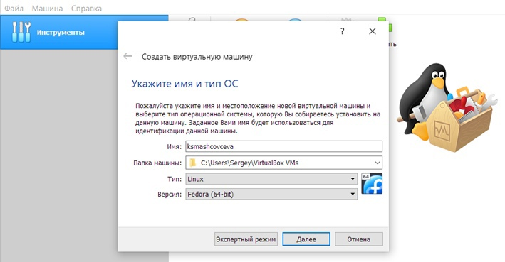{#fig:01 width=70%}

Указываю необходимый объём памяти (рис. [-@fig:02]).

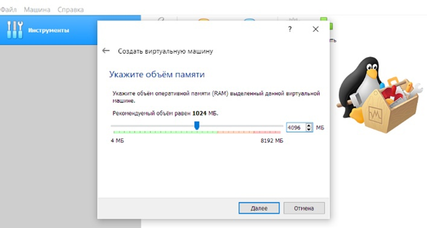{#fig:02 width=70%}

Создаю жёсткий диск (рис. [-@fig:03]).

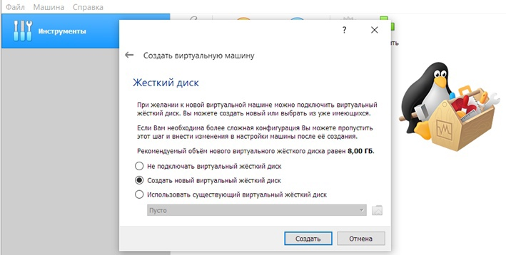{#fig:03 width=70%}

Задаю конфигурацию жёсткого диска – загрузочный, vdi, динамический виртуальный диск (рис. [-@fig:04], [-@fig:05], [-@fig:06]).

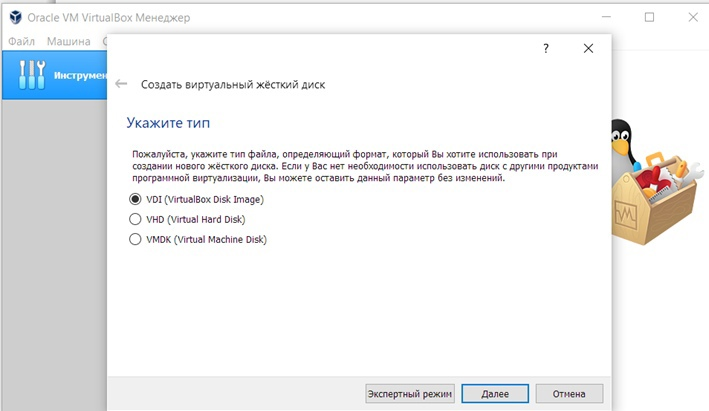{#fig:04 width=70%}

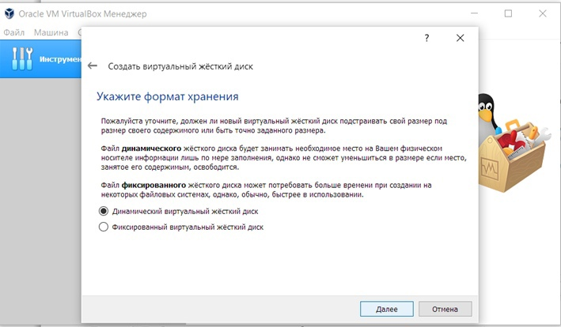{#fig:05 width=70%}

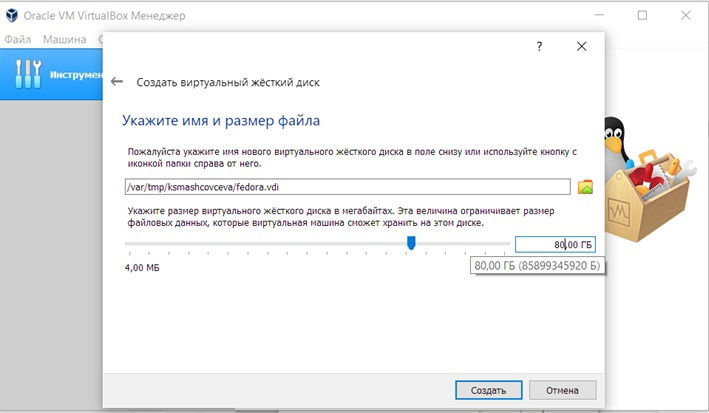{#fig:06 width=70%}

После создания виртуальной машины захожу в настройки и во вкладке «Дисплей» увеличиваю доступный объём видеопамяти до 128 МБ, а во вкладке «Носители» добавляю новый привод оптических дисков и выбираю Fedora (рис. [-@fig:07]).

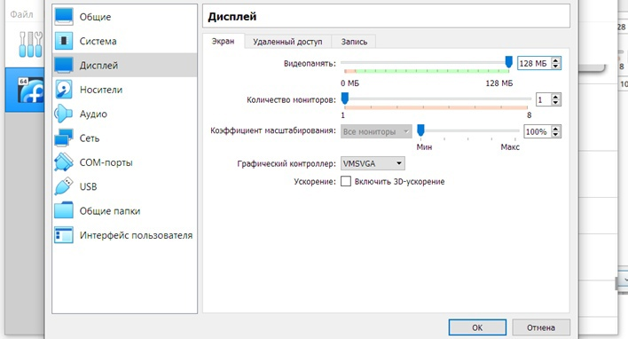{#fig:07 width=70%}

Запускаю виртуальную машину и выбираю «Install to Hard Drive» (рис. [-@fig:08]).

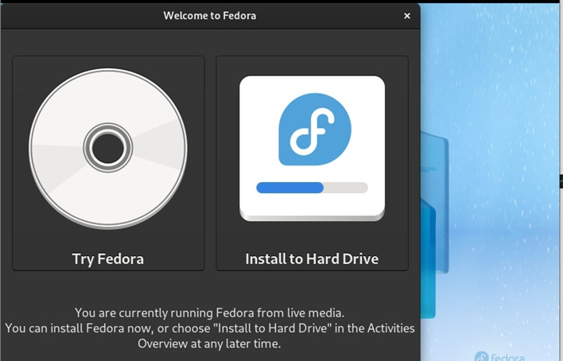{#fig:08 width=70%}

Корректирую часовой пояс, раскладку клавиатуры, место (рис. [-@fig:09], [-@fig:10], [-@fig:11], [-@fig:12]).

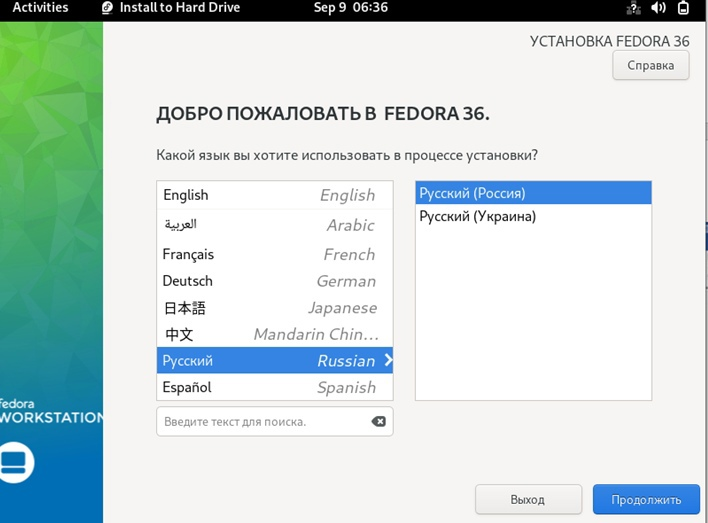{#fig:09 width=70%}

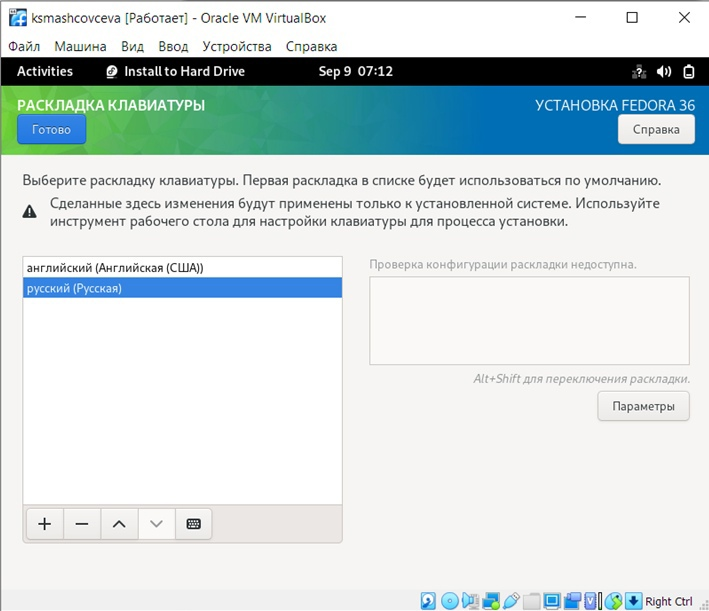{#fig:10 width=70%}

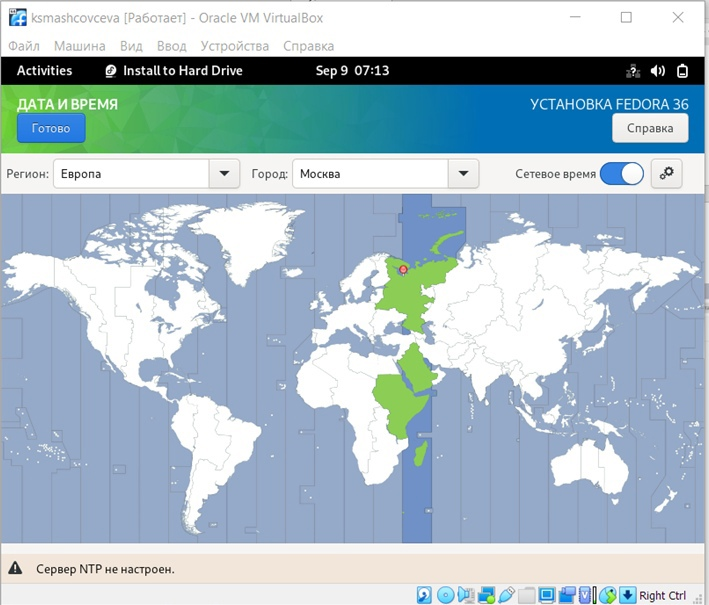{#fig:11 width=70%}

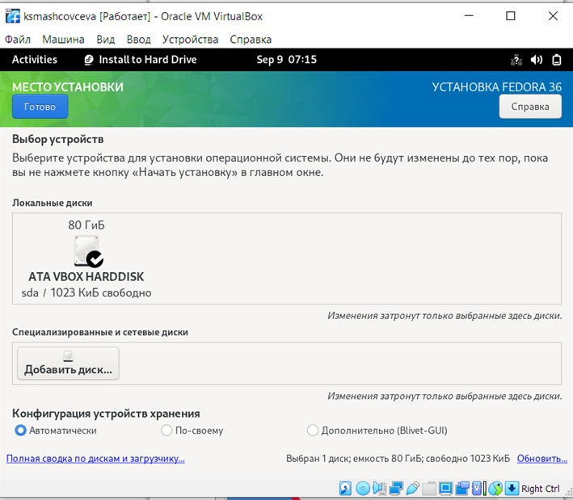{#fig:12 width=70%}

После этого начинаю установку, завершаю, закрываю систему. В настройках совершаю изъятие образа диска из дисковода (рис. [-@fig:13]).

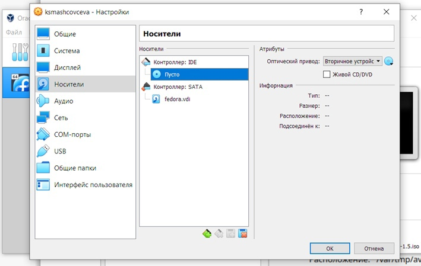{#fig:13 width=70%}

Далее снова запускаю виртуальную машину и в окне «О вас» выбираю имя пользователя, устанавливаю пароль (рис. [-@fig:14], [-@fig:15], [-@fig:16]).

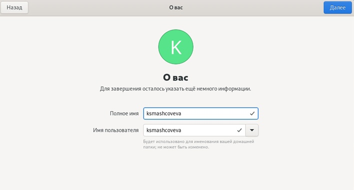{#fig:14 width=70%}

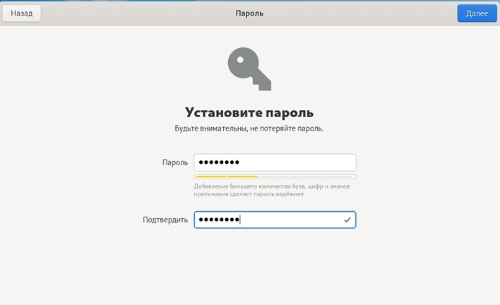{#fig:15 width=70%}

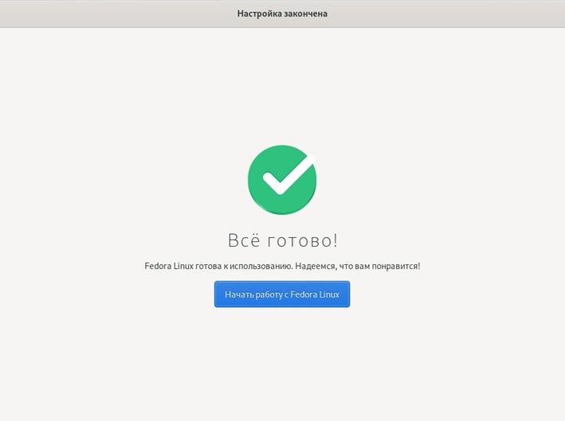{#fig:16 width=70%}

## Домашняя работа

С помощью команды dmesg | grep -i мы находим различные характеристики виртуальной машины (рис. [-@fig:17], [-@fig:18], [-@fig:19], [-@fig:20], [-@fig:21], [-@fig:22]).

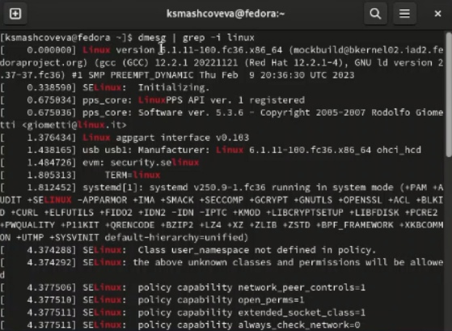{#fig:17 width=70%}

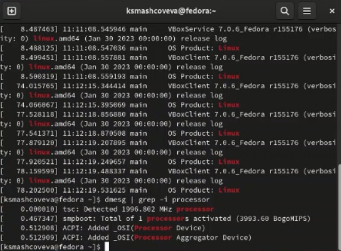{#fig:18 width=70%}

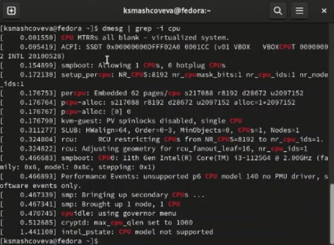{#fig:19 width=70%}

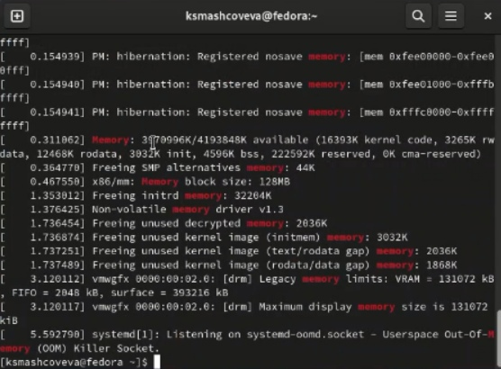{#fig:20 width=70%}

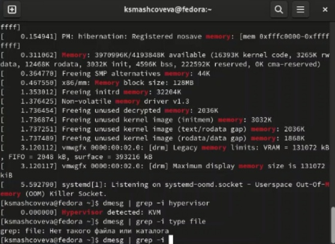{#fig:21 width=70%}

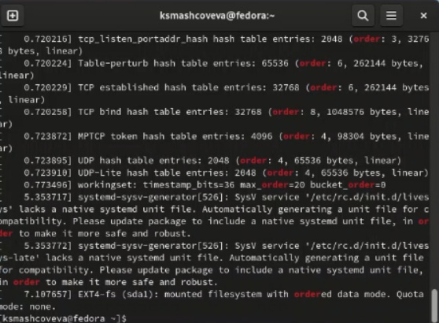{#fig:22 width=70%}

## Контрольные вопросы

1. содержит сведения, необходимые для идентификации пользователя при подключении к системе, а также информацию для авторизации и учёта.

2. man cd
cd ~
ls ~
du ~
mkdir ~/papka
rm ~/papka
history

4. /proc/mounts

5. $ kill -сигнал pid_процесса

# Выводы

Мы установили виртуальную машину, настроили ее и узнали ее основные характеристики.
