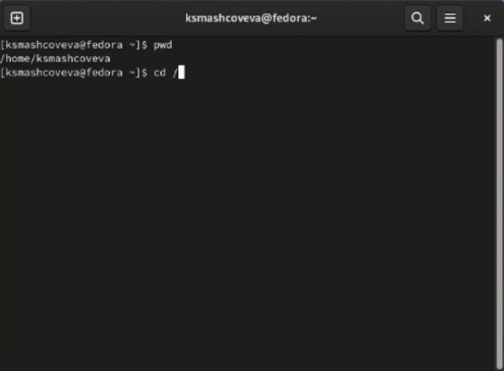
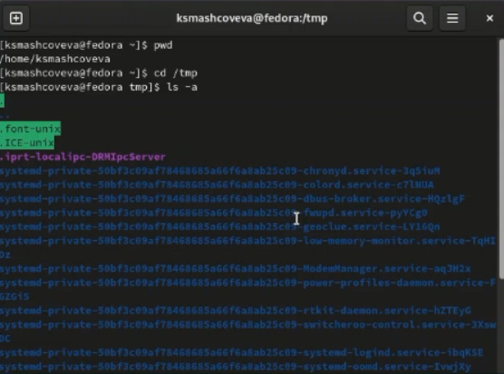
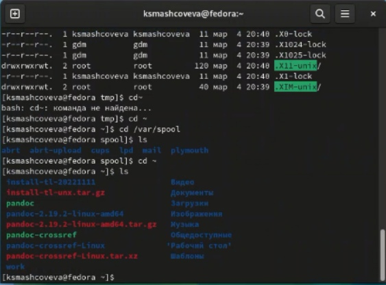
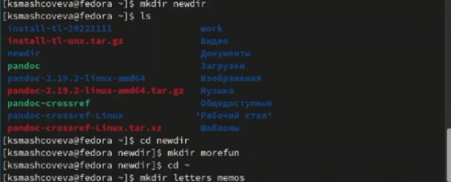
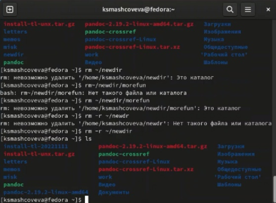
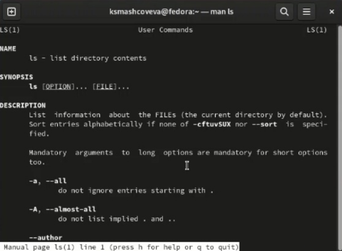
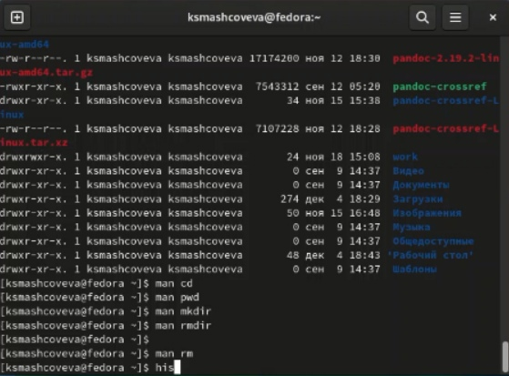
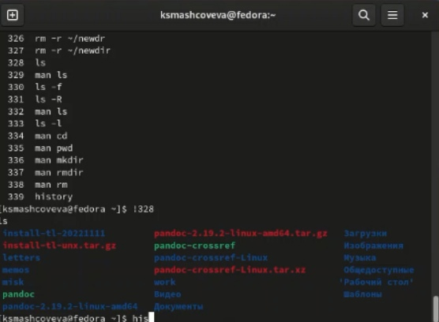

---
## Front matter
title: "Лабораторная работа №4"
subtitle: "Операционные системы"
author: "Машковцева Ксения, НКАбд-02-22"

## Generic otions
lang: ru-RU
toc-title: "Содержание"

## Bibliography
bibliography: bib/cite.bib
csl: pandoc/csl/gost-r-7-0-5-2008-numeric.csl

## Pdf output format
toc: true # Table of contents
toc-depth: 2
lof: true # List of figures
lot: true # List of tables
fontsize: 12pt
linestretch: 1.5
papersize: a4
documentclass: scrreprt
## I18n polyglossia
polyglossia-lang:
  name: russian
  options:
	- spelling=modern
	- babelshorthands=true
polyglossia-otherlangs:
  name: english
## I18n babel
babel-lang: russian
babel-otherlangs: english
## Fonts
mainfont: PT Serif
romanfont: PT Serif
sansfont: PT Sans
monofont: PT Mono
mainfontoptions: Ligatures=TeX
romanfontoptions: Ligatures=TeX
sansfontoptions: Ligatures=TeX,Scale=MatchLowercase
monofontoptions: Scale=MatchLowercase,Scale=0.9
## Biblatex
biblatex: true
biblio-style: "gost-numeric"
biblatexoptions:
  - parentracker=true
  - backend=biber
  - hyperref=auto
  - language=auto
  - autolang=other*
  - citestyle=gost-numeric
## Pandoc-crossref LaTeX customization
figureTitle: "Рис."
tableTitle: "Таблица"
listingTitle: "Листинг"
lofTitle: "Список иллюстраций"
lotTitle: "Список таблиц"
lolTitle: "Листинги"
## Misc options
indent: true
header-includes:
  - \usepackage{indentfirst}
  - \usepackage{float} # keep figures where there are in the text
  - \floatplacement{figure}{H} # keep figures where there are in the text
---

# Цель работы

Приобретение практических навыков взаимодействия пользователя с системой посредством командной строки.

# Выполнение лабораторной работы

Открываю виртуальную машину и терминал. С помощью команды pwd узнаю наименование домашнего каталога (рис. [-@fig:001]).

{#fig:001 width=70%}

Переходу в каталог /tmp и вывожу его содержимое на экран (рис. [-@fig:002]).

{#fig:002 width=70%}

Перехожу в каталог /var/spool и не нахожу там каталога cron (рис. [-@fig:003]).

{#fig:003 width=70%}

Далее с помощью команд mkdir создаю newdir и подакаталог morefun (рис. [-@fig:004]).

{#fig:004 width=70%}

Таким же образом создаю еще три каталога в корневом каталоге и удаляю newdir (рис. [-@fig:005]).

{#fig:005 width=70%}

Далее с помощью команды man ls узнаю, как нужно применять команду, чтобы вывести информацию о подкаталогах или отсортировать файлы по времени создания (рис. [-@fig:006]).

{#fig:006 width=70%}

С помощью команды man также просматриваю остальные команды из лабораторной работы (рис. [-@fig:007]).

{#fig:007 width=70%}

С помощью команды history вывожу информацию о последних командах и использую некоторые из них (рис. [-@fig:008]).

{#fig:008 width=70%}

## Контрольные вопросы

1. Командная строка или терминал - это прямое взаимодействие пользователя с компьютером

2. Команда pwd

3. Команда ls

4. Команда ls -a

5. Команда rm - удаляет файлы и каталоги, команда rmdir - только каталоги

6. Команда history

7. !номер команды

8. mkdir newdir; cd newdir

9. Символ экранирования /

10. Выводится с сортировкой по времени и с указанием владельца каталогов и файлов

11. Относительный путь - путь от текущего каталога
cd newdir - относительный путь
cd ~/newdir - абсолютный путь

12. Команда man выводит всю информацию о команде

13. Клавиша tab

# Выводы

По завершению мы приобрели практические навыки использования командной строки Линукс.
