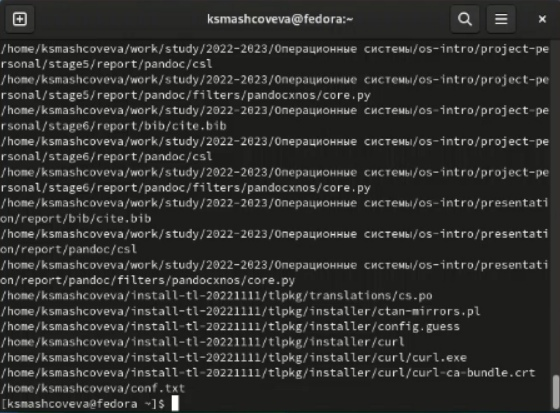

---
## Front matter
title: "Лабораторная работа №6"
subtitle: "Операционные системы"
author: "Машковцева Ксения, НКАбд-02-22"

## Generic otions
lang: ru-RU
toc-title: "Содержание"

## Bibliography
bibliography: bib/cite.bib
csl: pandoc/csl/gost-r-7-0-5-2008-numeric.csl

## Pdf output format
toc: true # Table of contents
toc-depth: 2
lof: true # List of figures
lot: true # List of tables
fontsize: 12pt
linestretch: 1.5
papersize: a4
documentclass: scrreprt
## I18n polyglossia
polyglossia-lang:
  name: russian
  options:
	- spelling=modern
	- babelshorthands=true
polyglossia-otherlangs:
  name: english
## I18n babel
babel-lang: russian
babel-otherlangs: english
## Fonts
mainfont: PT Serif
romanfont: PT Serif
sansfont: PT Sans
monofont: PT Mono
mainfontoptions: Ligatures=TeX
romanfontoptions: Ligatures=TeX
sansfontoptions: Ligatures=TeX,Scale=MatchLowercase
monofontoptions: Scale=MatchLowercase,Scale=0.9
## Biblatex
biblatex: true
biblio-style: "gost-numeric"
biblatexoptions:
  - parentracker=true
  - backend=biber
  - hyperref=auto
  - language=auto
  - autolang=other*
  - citestyle=gost-numeric
## Pandoc-crossref LaTeX customization
figureTitle: "Рис."
tableTitle: "Таблица"
listingTitle: "Листинг"
lofTitle: "Список иллюстраций"
lotTitle: "Список таблиц"
lolTitle: "Листинги"
## Misc options
indent: true
header-includes:
  - \usepackage{indentfirst}
  - \usepackage{float} # keep figures where there are in the text
  - \floatplacement{figure}{H} # keep figures where there are in the text
---

# Цель работы

Ознакомление с инструментами поиска файлов и фильтрации текстовых данных.
Приобретение практических навыков: по управлению процессами (и заданиями), по
проверке использования диска и обслуживанию файловых систем.

# Выполнение лабораторной работы

Запускаю виртуальную машину. Читаю содержимое лабораторной работы и приступаю к выполнению. Для этого создаю файл file.txt и с помощью команды ls /etc > file.txt переношу содержимое каталога /etc в файл  (рис. [-@fig:01]).

{#fig:01 width=70%}

Далее с помощью команды grep я записываю в файл conf.txt все строки из файла file.txt с расширением .conf  (рис. [-@fig:02]).

{#fig:02 width=70%}

В следующем задании с помощью команды find я нахожу все файлы в домашней директории, начинающиеся с буквы с (рис. [-@fig:03]).

{#fig:03 width=70%}

Далее я вывожу имена файлов из каталога /etc, начинающиеся с буквы h (рис. [-@fig:04]).

{#fig:04 width=70%}

Далее с помощью & я запускаю фоновый процесс записи в файл logfile.txt. После завершения процесса я удаляю файл (рис. [-@fig:05]).

{#fig:05 width=70%}

Затем я запускаю в фоновом режиме редактор gedit (рис. [-@fig:06]).

{#fig:06 width=70%}

После чего, я читаю описание команды kill и завершаю процесс (рис. [-@fig:07]).

{#fig:07 width=70%}

В следующем задании я читаю описание команд df и du и запускаю их в терминале (рис. [-@fig:08, -@fig:09]).

{#fig:08 width=70%}

{#fig:09 width=70%}

Наконец, с помощью команды find я вывожу имена всех директорий в домашнем каталоге (рис. [-@fig:10]).

{#fig:10 width=70%}

## Контрольные вопросы

1. Байтовые и символьные

2. > при каждом вызове создает новый файл (перезапись).
>> При вызове дописывает в файл без его перезаписи.

3. Набор процессов, связанных вместе их стандартными потоками, так что выходной текст каждого процесса (stdout) передается непосредственно в качестве входных данных (stdin) следующему процессу.

4. Программа - это набор инструкций, который позволяет ЦПУ выполнять определенную задачу, в то время как процесс - это исполняемая программа.

5. pid: Идентификатор процесса (PID) процесса, в котором вы вызываете Process.pidметод.
gid: Идентификатор группы UNIX, под которым выполняется программа.

# Выводы

Мы познакомились с инструментами поиска файлов и фильтрации текстовых данных.

