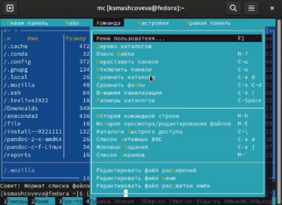

---
## Front matter
title: "Лабораторная работа №7"
subtitle: "Операционные системы"
author: "Машковцева Ксения, НКАбд-02-22"

## Generic otions
lang: ru-RU
toc-title: "Содержание"

## Bibliography
bibliography: bib/cite.bib
csl: pandoc/csl/gost-r-7-0-5-2008-numeric.csl

## Pdf output format
toc: true # Table of contents
toc-depth: 2
lof: true # List of figures
lot: true # List of tables
fontsize: 12pt
linestretch: 1.5
papersize: a4
documentclass: scrreprt
## I18n polyglossia
polyglossia-lang:
  name: russian
  options:
	- spelling=modern
	- babelshorthands=true
polyglossia-otherlangs:
  name: english
## I18n babel
babel-lang: russian
babel-otherlangs: english
## Fonts
mainfont: PT Serif
romanfont: PT Serif
sansfont: PT Sans
monofont: PT Mono
mainfontoptions: Ligatures=TeX
romanfontoptions: Ligatures=TeX
sansfontoptions: Ligatures=TeX,Scale=MatchLowercase
monofontoptions: Scale=MatchLowercase,Scale=0.9
## Biblatex
biblatex: true
biblio-style: "gost-numeric"
biblatexoptions:
  - parentracker=true
  - backend=biber
  - hyperref=auto
  - language=auto
  - autolang=other*
  - citestyle=gost-numeric
## Pandoc-crossref LaTeX customization
figureTitle: "Рис."
tableTitle: "Таблица"
listingTitle: "Листинг"
lofTitle: "Список иллюстраций"
lotTitle: "Список таблиц"
lolTitle: "Листинги"
## Misc options
indent: true
header-includes:
  - \usepackage{indentfirst}
  - \usepackage{float} # keep figures where there are in the text
  - \floatplacement{figure}{H} # keep figures where there are in the text
---

# Цель работы

Освоение основных возможностей командной оболочки Midnight Commander. Приобретение навыков практической работы по просмотру каталогов и файлов; манипуляций
с ними.

# Выполнение лабораторной работы

Мы изучаем информацию о mc с помощью команды man (рис. [-@fig:01]).

{#fig:01 width=70%}

Затем запускаем mc из командной строки и изучаем интерфейс (рис. [-@fig:02]).

{#fig:02 width=70%}

После этого выполняем несколько операций, используя управляющие клавиши, выполняем основные команды меню левой панели. 

Знакомимся с подменю Файл, просматривая содержимое текстового файла, редактируя его, создавая каталог и копируя файл туда (рис. [-@fig:03]).

{#fig:03 width=70%}

Далее знакомимся с подменю Команда, запуская поиск в файловой системе, выбирая и повторяя предыдущую команду, переходя в домашний каталог и анализируя меню файла (рис. [-@fig:04]).

{#fig:04 width=70%}

Затем знакомимся с подменю Настройки (рис. [-@fig:05]).

{#fig:05 width=70%}

После этого создаю текстовый файл text.txt. Открываю его с помощью встроенного редактора и копирую туда текст (рис. [-@fig:06]).

{#fig:06 width=70%}

Затем я:

1. Удаляю строку текста

2. Выделяю фрагмент и копирую его на новую строку

3. Выделяю фрагмент и переношу его на новую строку

4. Сохраняю файл

5. Отменяю последнее действие

После этого я открываю файл с исходным текстом на языке программирования.

# Выводы

Итак, мы познакомились с mc и его встроенным редактором, узнали горячие клавиши и основные инструменты при работе. 
